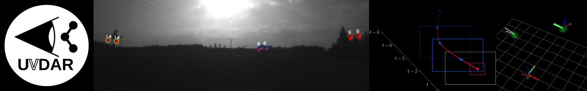

[#](#) UVDAR drivers and processing



| Build status | [](https://github.com/ctu-mrs/uvdar_core/actions) | [](https://github.com/ctu-mrs/uvdar_core/actions) |
|--------------|-------------------------------------------------------------------------------------------------------------------------------------|------------------------------------------------------------------------------------------------------------------------------------|

## Description
This package contains the core signal processing and pose estimation software components of the UVDAR system necessary for running it on a MAV.

* the UVDAR system is a visual mutual relative localization system for cooperating micro-scale UAVs
* based on ultraviolet-sensitive cameras and blinking ultraviolet markers
* can be used both indoors and outdoors without infrastructure
* robust to a variety of lighting conditions

## Releavant papers
{::options parse_block_html="true" /}
* <details>
  <summary>V Walter, M Saska and A Franchi. Fast mutual relative localization of uavs using ultraviolet led markers. In 2018 International Conference on Unmanned Aircraft System (ICUAS 2018). 2018.</summary>
```
@inproceedings{uvdd1,
	author = "V. Walter and M. Saska and A. Franchi",
	title = "Fast mutual relative localization of uavs using ultraviolet led markers",
	booktitle = "2018 International Conference on Unmanned Aircraft System (ICUAS 2018)",
	pdf = "data/papers/uvdd1.pdf",
	year = 2018
}
```
{::options parse_block_html="false" /}

</details>

## System requirements

#### Hardware:
* One or more calibrated (Using the OCamCalib model) grayscale camera sensors with ultraviolet bandpass filters. In our setup these are:
  * mvBlueFOX MLC200wG cameras
  * Sunnex DSL215 lenses with ~180 degrees of horizontal FOV
  * Midopt BP365-R6 filters with our custom holder between the sensor and the lens

* Blinking ultraviolet LEDs (395nm) attached to extreme points of the target UAVs. In our setup, these are:
  * ProLight Opto PM2B-1LLE
  * Attached to the ends of the arms of the UAVs
  %% * , respectively on the top of the UAVs for "beacons"
  * For quadrotors, the markers comprise two LEDs each, rotated 90&deg; from each other in the "yaw" axis of the UAV
  
* [Blinking signal generator](https://github.com/ctu-mrs/mrs_hw_uvdar)
  * Implemented as our open-hardware [board and firmware](https://github.com/ctu-mrs/mrs_hw_uvdar)
#### Software
  * [ROS (Robot Operating System)](https://www.ros.org/) Melodic Morenia
  * [mrs_lib](https://github.com/ctu-mrs/mrs_lib) - ROS package with utility libraries used by the MRS group
  * [mrs_msgs](https://github.com/ctu-mrs/mrs_msgs) - ROS package with message types used by the MRS group
  * [bluefox2](https://github.com/ctu-mrs/bluefox2) - ROS package providing interface with mvBlueFOX cameras


#### For testing in simulation
  * [mrs_uav_system](https://github.com/ctu-mrs/mrs_uav_system) - Our ROS-based ecosystem for flying and testing multi-UAV systems
  * [uvdar_gazebo_plugin](https://github.com/ctu-mrs/uvdar_gazebo_plugin) - Emulation library that produces meta-data that is used for generation of synthetic UV LED image stream in simulation

## Installation
Install the dependencies.
Clone this repository into a ROS workspace as a package.
If you are using the `mrs_modules` meta package (currently only accessable internally to MRS staff, to be released at later date), this repository is already included.
Build the package using catkin tools (e.g. `catkin build uvdar_core`)

## Testing
In order to test the system in simulation, install all software dependencies including those designated for testing in simulation (Above) and run this script in the [scripts](scripts/) folder:
  %% * For testing separation of units based on position and beacons use [beacon_test.sh](scripts/beacon_test.sh)
  %% * For testing separation of units based on different blinking frequencies [multi_frequency_test.sh](scripts/multi_frequency_test.sh)
  * For testing separation of units based on different blinking signal sequences [simulation_baseline_test.sh](scripts/simulation_baseline_test.sh)

Note, that the script slows down the simulation below real-time. This is necessary, since if Gazebo slows down automatically due to insufficient processing power, the blinking signals get corrupted. Test the maximum admissible real-time factor for your computer by checking how far you can increase / have to decrease it such that the real-time factor consistently stays at the value it was set to.

## Node description
The package comprises multiple ROS nodes (N) and nodelets (n):
  * [UVDARDetector](src/detector.cpp) - n - detects bright points from the UV camera image. These are used as candidates for UV LED markers
  * [UVDARBlinkProcessor](src/blink_processor.cpp) - n - Extracts blinking signals and image positions of the markers detected previously
  * [UVDARPoseCalculator](src/uav_pose_calculator.cpp) - N - Calculates approximate pose and error covariances of the MAVs carrying the UV LED markers. Note, that this is an example for the specific layouts on quadrotors and hexarotors we use. If you need a different layout, you will also need to write your custom pose calculation
  * [UVDARKalman](src/filter.cpp) - N - Filters out sets of detected poses with covariances based on positions or the included identities. This filtering occurs in a selected coordinate frame

  * [UVDARBluefoxEmulator](src/bluefox_emulator.cpp)  - n - Generates an image stream similar to the output of our Bluefox cameras with UV bandpass filters (above). This image is currently rudimentary, with background of a constant shade of grey and white circles where the markers appeared. The function of this node depends on our [uvdar_gazebo_plugin](https://github.com/ctu-mrs/uvdar_gazebo_plugin), with which it needs to communicate
  * [MaskGenerator](src/mask_generator.cpp) - N - Generates masks for specific camearas on specific MAVs. This is necessary to suppress detections of marers on the given observer, as well as reflection from e.g. its metallic surfaces in front of the camera. The masks can be also generated manually.
  * [LedManager](src/led_manager.cpp) - N - Sends commands to our controller boards that set the signals of the blinking UV LEDs on the current MAV using the Baca Protocol. You can command this node using ROS services. This is loaded using [led_manager.launch](launch/led_manager.launch).

## Acknowledgements

### MRS group
This work would not be possible without the hard work, resources and support from the [Multi-Robot Systems (MRS)](http://mrs.felk.cvut.cz/) group from Czech Technical University.

### Included libraries
This package contains the following third-party libraries by the respective authors:
  * [OCamCalib](https://sites.google.com/site/scarabotix/ocamcalib-toolbox) calibration system by Davide Scaramuzza - only the C++ sources
  * [P3P](https://www.laurentkneip.com/software) library by Laurent Kneip
